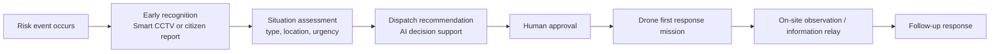
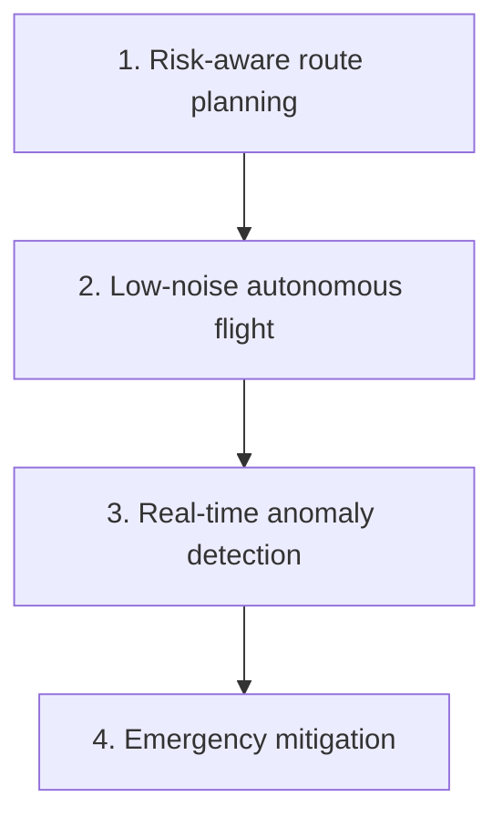

```markdown
# Public Safety First Response System

A prototype public-safety first-response system that links **smart CCTV-based early incident recognition** with **safety-aware drone response** in urban environments.

This project treats the drone not as an isolated vehicle, but as part of a broader **public-safety workflow**:

**early recognition -> dispatch recommendation -> human approval -> drone first response**

---

## Overview

The system is organized into three layers:

- **Perception layer**: smart CCTV or citizen-report-based early incident recognition
- **Decision-support layer**: temporal verification and human-in-the-loop dispatch recommendation
- **Drone response layer**: risk-aware navigation, anomaly detection, and emergency mitigation

The main design principle is:

**human safety > infrastructure safety > vehicle safety > payload**

---

## System Flow



---

## Internal Drone Safety Stack



The drone stack combines:

- **risk-aware route planning** using an offline ground-risk prior
- **real-time anomaly detection** with LSTM + rules + FSM
- **multi-layer emergency mitigation** with parachute, secondary cushion, and airbag logic

---

## Repository Structure

```text
public-safety-first-response/
├─ cctv/         # early recognition and dispatch recommendation
├─ drone/        # planning, anomaly detection, emergency sequencing
├─ integration/  # end-to-end workflow demo
├─ docs/         # architecture notes and competition materials
└─ presentations/
```

---

## What Is Implemented

### CCTV layer
- lightweight YOLO-based risk-object detection demo
- temporal event verification
- human-in-the-loop dispatch recommendation

### Drone layer
- urban risk-aware route-planning prototype
- in-flight anomaly-detection prototype
- emergency sequencer demo
- integrated drone safety notebooks

### Integration layer
- end-to-end workflow scaffold:
  **CCTV/report -> recommendation -> human approval -> drone mission request**

---

## Current Demo Scope

Current CCTV demo classes are limited to:

- `fire`
- `knife`

These are **representative example classes** under limited public datasets.  
The intended full system assumes broader public-safety data and additional event categories.

This means the current demo supports:

- early **risk-object recognition**
- dispatch recommendation support

It does **not** yet fully solve:

- violence understanding
- riot understanding
- person-weapon-behavior reasoning
- large-scale real-world deployment

---

## Implemented vs Conceptual

### Implemented / Prototype
- lightweight CCTV detection demo
- dispatch recommendation logic
- route-planning prototype
- anomaly-detection prototype
- emergency sequencing demo
- end-to-end orchestration scaffold

### Conceptual / Future Work
- broader multi-class CCTV training
- dynamic real-time risk estimation
- confidence-aware real-time gating
- hardware validation of staged airbag deployment
- hardware validation of secondary cushion deployment
- large-scale smart-city deployment

---

## Main Notebooks

Recommended order:

1. `integration/notebooks/Public_Safety_EndToEnd_Demo.ipynb`
2. `cctv/notebooks/CCTV_Public_Safety_Detection_Colab.ipynb`
3. `drone/notebooks/FullIntegratedDroneSafety_Colab.ipynb`

Additional module-specific notebooks:
- `drone/notebooks/안전_경로_알고리즘_v2.ipynb`
- `drone/notebooks/EmergencySequencer_Colab.ipynb`

---

## My Contribution

My main contribution focused on:

- system-level problem formulation for public-safety first response
- integration of CCTV recognition and drone dispatch workflow
- risk-aware drone route-planning design
- anomaly-detection and emergency-transition logic
- multi-layer emergency mitigation architecture
- notebook-based prototyping and validation flow

---

## Datasets and Weights

This public repository does **not** include:

- raw large-scale datasets
- trained weights
- experiment runs
- large intermediate artifacts

The repository is intentionally kept lightweight and presentation-ready.

---

## Why This Project Matters

Urban public-safety drone deployment is not just a control problem.  
It is a **system-design problem** that requires:

- early recognition
- decision support
- human approval
- safe autonomous response
- emergency harm mitigation

This repository presents that broader perspective through a prototype implementation.

