# Public Safety First Response System

지능형 CCTV의 위험 객체 조기 인지와 자율주행 드론의 초기 대응을 연결한 공공 안전 first-response 시스템 프로토타입입니다.

이 프로젝트는 드론을 단독 비행체로 보기보다, **조기 인지 -> 출동 권고 -> 관제자 승인 -> 드론 초기 대응**으로 이어지는 공공 안전 워크플로우의 일부로 다룹니다.

## System Concept

```mermaid
flowchart LR
    A["Risk Event<br/>fire / weapon / report"] --> B["CCTV Perception<br/>YOLO detection"]
    B --> C["Temporal Verification<br/>event gate"]
    C --> D["Dispatch Recommendation<br/>risk score"]
    D --> E["Human Approval<br/>operator-in-the-loop"]
    E --> F["Drone Mission Request"]
    F --> G["Risk-Aware Path Planning"]
    G --> H["In-flight Safety Monitoring"]
    H --> I["Emergency Sequencer<br/>parachute / cushion / airbag"]
    I --> J["First Response Support<br/>observation / relay"]
```



## Design Principle

본 시스템의 우선순위는 다음과 같습니다.

```text
human safety > infrastructure safety > vehicle safety > payload
```

따라서 드론 경로 계획, 이상 감지, 비상 시퀀스는 모두 임무 성공보다 인명 피해 최소화를 우선하도록 구성했습니다.

## Repository Structure

```text
public-safety-first-response/
├── cctv/          # CCTV 객체 탐지, 시계열 검증, 출동 권고
├── integration/   # 사건 메시지, 관제자 승인, 드론 임무 메시지
├── drone/         # 위험 인지형 경로 계획, 이상 감지, 비상 대응
└── docs/          # 설계 문서, 발표자료, 참고 자료
```

## Main Components

| Module | Role |
|---|---|
| `cctv/` | CCTV 영상에서 `fire`, `knife` 등 위험 객체를 탐지하고, 시계열 누적 검증을 통해 출동 권고를 생성합니다. |
| `integration/` | CCTV 인지 결과를 사건 메시지, 관제자 승인, 드론 임무 요청으로 연결하는 end-to-end workflow를 검증합니다. |
| `drone/` | 도심 환경에서 위험 인지형 경로 계획, 비행 중 이상 감지, 비상 대응 시퀀스를 실험합니다. |
| `docs/` | 시스템 개요, 대회 자료, 설계 문서, 포스터 및 참고 자료를 정리합니다. |

## Main Notebooks

Recommended reading order:

1. `integration/notebooks/Public_Safety_EndToEnd_Demo.ipynb`
2. `cctv/notebooks/CCTV_Public_Safety_Detection_Colab.ipynb`
3. `drone/notebooks/RiskAware_Path_Stages_Colab.ipynb`
4. `drone/notebooks/FullIntegratedDroneSafety_Colab.ipynb`
5. `drone/notebooks/EmergencySequencer_Colab.ipynb`

## Implemented Scope

Implemented / prototyped:

- YOLO 기반 위험 객체 탐지 데모
- 시계열 event gate 기반 오탐 완화
- human-in-the-loop 출동 승인 흐름
- 위험 인지형 경로 계획 프로토타입
- LSTM + rule + FSM 기반 비행 이상 감지 구조
- 낙하산, 충격 완화체, 에어백을 포함한 비상 대응 시퀀스 데모

Not fully solved:

- 실제 CCTV 대규모 데이터 기반 폭력/군중 상황 이해
- 실시간 도시 위험도 추정
- 실제 드론 하드웨어 연동 및 비행 검증
- 안전장치의 물리 실험 검증
- 대규모 공공 안전 시스템 배포

## My Contribution

이 프로젝트에서 제 주된 기여는 시스템 수준의 문제 정의, CCTV 인지 결과와 드론 출동 흐름의 통합, 위험 인지형 경로 계획, 비행 이상 감지 및 비상 전환 로직 설계, notebook 기반 프로토타입 검증입니다.

## AI Assistance

이 프로젝트의 코드 정리, 노트북 빌더 스크립트 구성, README 문서화, 모듈 구조 정리 과정에는 Codex (GPT-5.5)를 활용한 vibe coding 방식을 일부 사용했습니다.

다만 시스템 문제 정의, 공공 안전 워크플로우 설계 방향, 드론 안전 로직의 우선순위, 최종 코드와 문서의 채택 여부는 직접 검토해 반영했습니다. 따라서 이 저장소는 AI assistance를 활용한 개인/팀 프로젝트 정리본이며, 최종 책임 있는 해석과 설계 판단은 작성자가 수행했습니다.

## Note

이 저장소는 대회 및 학습 과정에서 만든 공공 안전 first-response 시스템 프로토타입입니다. 실제 공공 안전 시스템이나 드론 안전 인증 수준의 구현이 아니며, 아이디어 검증과 모듈별 실험 기록에 가깝습니다.
