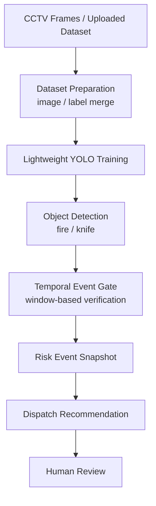

# CCTV Module

CCTV 영상에서 위험 객체를 조기 탐지하고, 단일 프레임 탐지 결과를 시계열로 검증해 출동 권고로 연결하는 모듈입니다.

현재 시연 대상 클래스는 `fire`, `knife`이며, 원천 데이터와 학습된 모델 가중치는 Git에 포함하지 않습니다.

## Module Flow

## What This Module Does

- CCTV 또는 업로드된 영상/이미지 데이터에서 위험 객체 탐지 데이터셋을 구성합니다.
- YOLO 기반 lightweight detector를 학습하는 Colab 노트북을 제공합니다.
- 단일 프레임 탐지 결과를 바로 출동 판단으로 사용하지 않고, 시계열 event gate를 거쳐 오탐 가능성을 줄입니다.
- 검증된 위험 이벤트를 통합 모듈에서 사용할 수 있는 사건 snapshot 형태로 넘기는 것을 목표로 합니다.

## Main Notebook

- `notebooks/CCTV_Public_Safety_Detection_Colab.ipynb`

## Source Script

- `scripts/build_cctv_public_safety_detection_notebook.py`

## Current Limitations

- 현재 클래스는 `fire`, `knife` 중심의 제한된 데모입니다.
- 원천 데이터와 학습 결과는 저장소에 포함하지 않습니다.
- 실제 공공 CCTV 환경에서 필요한 다양한 조명, 각도, 군중, 가림, 저화질 조건은 충분히 반영하지 못했습니다.

## Future Work

- 더 넓은 공공 안전 이벤트 클래스 확장
- confidence-aware event gate 개선
- 객체 탐지와 행동/상황 인식의 결합
- 실제 CCTV stream 기반 inference pipeline 구성
