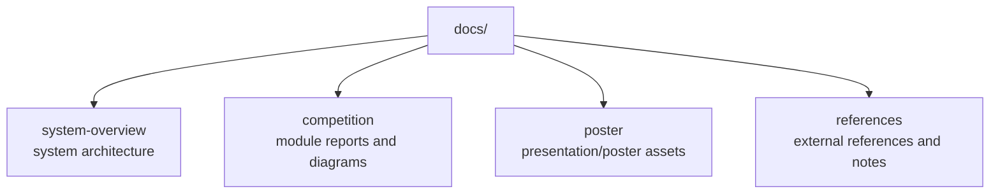

# Documentation

이 폴더는 `public-safety-first-response` 프로젝트의 설계 문서, 발표자료를 정리합니다.

## Document Map

## Note

이 폴더의 자료는 문제 정의와 설계 의도를 설명하는 보조 문서입니다. 실제 실행 가능한 프로토타입은 `cctv/`, `integration/`, `drone/` 하위 노트북과 소스 코드를 우선 확인하는 것이 좋습니다.
