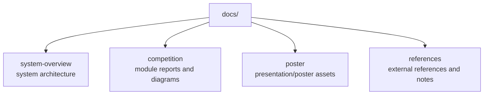

# Documentation

이 폴더는 `public-safety-first-response` 프로젝트의 설계 문서, 발표자료, 시스템 개요, 참고 자료를 정리합니다.

## Document Map

## Contents

- `system-overview/`  
  전체 시스템 개요와 상위 구조 자료를 정리합니다.

- `competition/`  
  CCTV 조기 인지, 안전 경로 계획, 실시간 이상 감지, 안전장치 등 대회 준비 과정에서 작성한 모듈별 자료를 포함합니다.

- `poster/`  
  포스터 또는 발표용 산출물을 정리하기 위한 폴더입니다.

- `references/`  
  참고 자료와 출처를 정리하기 위한 폴더입니다.

## Note

이 폴더의 자료는 시스템 구현 코드라기보다, 문제 정의와 설계 의도를 설명하는 보조 문서입니다. 실제 실행 가능한 프로토타입은 `cctv/`, `integration/`, `drone/` 하위 노트북과 소스 코드를 우선 확인하는 것이 좋습니다.
