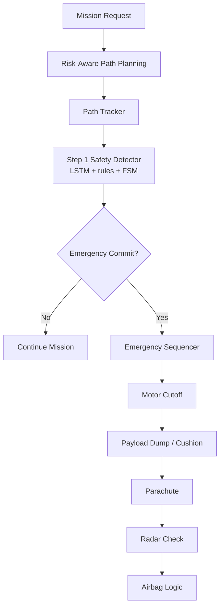

# Drone Safety Module

드론의 위험 인지형 경로 계획, 비행 중 이상 감지, 비상 대응 시퀀스를 다루는 모듈입니다.

이 모듈의 핵심은 드론이 목적지로 빠르게 이동하는 것보다, 도심 환경에서 사람과 인프라에 대한 위험을 줄이는 방향으로 경로와 비상 대응을 설계하는 것입니다.

## Safety Stack

## Main Parts

### Risk-aware path planning

도심 환경에서 건물과 지상 위험도를 고려한 경로 계획을 실험합니다. 기본 A* 경로에서 시작해, 건물 이격 거리, ground-risk prior, expected harm 기반 비용 항을 단계적으로 추가합니다.

### Path tracking interface

`path_tracker.py`는 계획 경로와 현재 위치를 비교해 cross-track error, vertical error 등 Step 1 감지기가 사용할 수 있는 추적 신호를 계산합니다.

### Step 1 safety detector

`step1_safety_detector.py`는 LSTM 이상 감지 출력, 규칙 기반 감시자, FSM을 결합해 이상 의심, 이상 확정, 비상 전환 여부를 판단합니다.

### Emergency sequencer

`emergency_sequencer.py`는 비상 전환 이후 motor cutoff, payload/cushion, parachute, radar check, airbag logic 등 단계적 비상 대응을 상태 머신으로 구성합니다.

## Main Notebooks

- `notebooks/RiskAware_Path_Stages_Colab.ipynb`
- `notebooks/FullIntegratedDroneSafety_Colab.ipynb`
- `notebooks/EmergencySequencer_Colab.ipynb`
- `notebooks/안전_경로_알고리즘_v2.ipynb`

## Source Code

- `src/path_tracker.py`
- `src/step1_safety_detector.py`
- `src/emergency_sequencer.py`

## Current Limitations

- 실제 드론 하드웨어 검증은 수행하지 않았습니다.
- 안전장치 전개 물리 모델은 시뮬레이션 및 개념 검증 수준입니다.
- ground-risk map은 실제 도시 데이터와 실시간 인구 밀도를 반영하지 못했습니다.
- LSTM 모델은 실제 비행 이상 데이터 기반 production 모델이 아닙니다.

## Future Work

- 실제 flight log 기반 이상 감지 데이터셋 구성
- ground-risk map과 semantic map의 실제 데이터 연동
- MPC, rule-based fail-safe, learned detector 간 비교
- 안전장치 전개 조건의 물리 실험 또는 고정밀 시뮬레이션 검증
****
