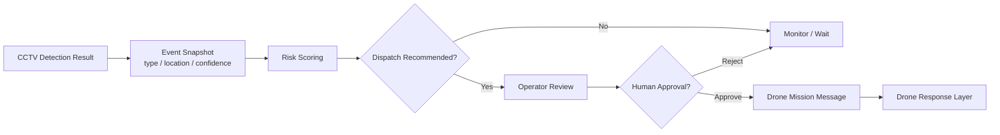

# Integration Module

CCTV 조기 인지 결과를 관제자 승인과 드론 임무 메시지로 연결하는 end-to-end workflow 데모 모듈입니다.

이 모듈은 각 기술 요소의 성능을 평가하기보다, **위험 인지 결과가 실제 출동 판단과 드론 임무 요청으로 어떻게 이어지는지**를 검증하는 데 목적이 있습니다.

## Workflow

## What This Module Does

- CCTV 또는 신고 기반 사건 정보를 `EventSnapshot` 형태로 표현합니다.
- 사건 유형, 위치, 외부 신고 여부, hotspot 여부 등을 기반으로 출동 권고 점수를 계산합니다.
- human-in-the-loop 구조를 반영해 관제자 승인 후에만 드론 임무 메시지를 생성합니다.
- CCTV, 의사결정, 드론 대응 계층이 서로 어떤 데이터를 주고받는지 확인합니다.

## Main Notebook

- `notebooks/Public_Safety_EndToEnd_Demo.ipynb`

## Source Script

- `scripts/build_public_safety_end_to_end_demo.py`

## Design Choice

드론 출동은 자동 실행이 아니라 관제자 승인 이후 수행되는 것으로 가정했습니다. 이는 오탐, 사생활, 현장 안전, 법적 책임 문제를 고려한 설계입니다.

## Future Work

- 실제 detector output과의 연결
- 위치 기반 위험도 및 접근 가능성 반영
- 관제자 UI 또는 dashboard prototype 연동
- 임무 우선순위와 다중 이벤트 처리 로직 추가

